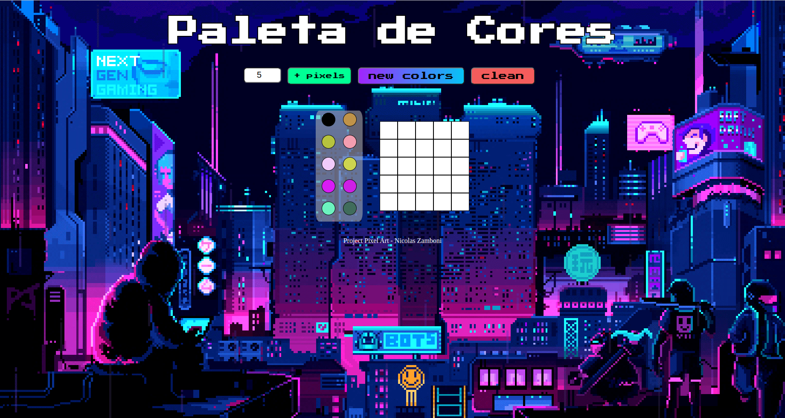

## Sejam bem vindos ao projeto Pixel Art

- O Pixel-Art consiste em uma pagina web, onde você poderá utilizar uma paleta de cores funcional que poderá ser utilizada para criar diversos desenhos em forma de pixel. Além disso foi adicionado uma função onde você pode gerar novas cores aleatórias, assim sua arte sempre ficará colorida.
- Para a realização do projeto foi utilizado `javascript`, `css` e `html`.

## Habilidades Utilizadas

- Manipulação do JavaScript

- Manipulação do CSS

- Manipulação do DOM

---

# Como acessar a aplicação:

Link da aplicação <a href='https://nicolaszamboni.github.io/Project-Pixel-Art/'>Pixel Art</a>

## Como foi desenvolvido

**💡Veja o exemplo a seguir de como o projeto ficou depois de pronto.

